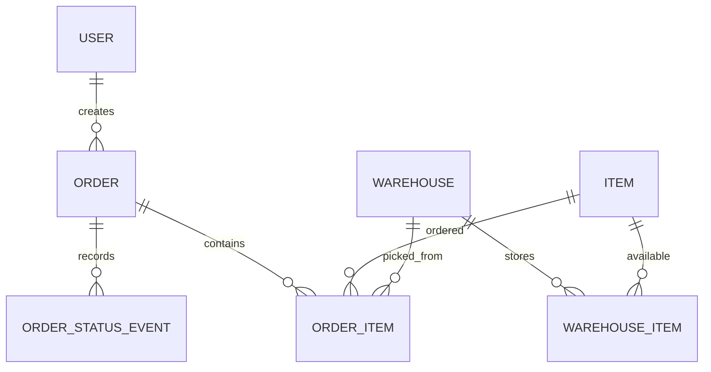

# Architecture

Questo documento e la fonte di verita tecnica di Stockly.

Input principale: `docs/requirements.md`.

Le regole funzionali non sono duplicate qui: quando servono, questo documento rimanda ai requisiti.

---

# 1. Stack Tecnologico

## Stile Architetturale

Stockly e un monolite web Spring Boot.

La scelta del monolite e intenzionale:

* il dominio e compatto;
* le funzionalita sono correlate;
* il deploy deve restare semplice;
* il team ha forte competenza backend e limitata esperienza frontend.

## Backend

* Java 21;
* Spring Boot;
* Spring MVC;
* Spring Data JPA;
* Hibernate;
* Spring Security;
* Maven.

## Frontend

* Thymeleaf;
* Bootstrap;
* HTMX solo se aggiunge valore concreto.

## Database

* H2 in-memory per POC e test locali mirati;
* H2 file-based per sviluppo locale leggero;
* PostgreSQL come target per ambienti maturi e produzione;
* Flyway per migrazioni versionate.

## Profili Spring

Profili supportati:

* `local`: sviluppo locale con H2 file-based in `.data/stockly-local` e seed demo iniziale;
* `poc`: proof of concept con H2 in-memory, H2 console e seed demo;
* `test`: test automatici con H2 in-memory, H2 console disattiva e `server.port=0`;
* `prod`: ambiente produttivo con datasource PostgreSQL configurato da variabili ambiente.

Regole:

* nessun profilo applicativo deve essere attivato come default globale;
* il profilo `poc` deve essere esplicito;
* H2 console deve essere attiva solo in `local` e `poc`;
* `prod` non deve contenere segreti hardcoded;
* `test` non deve usare la porta `8080`.

## Deploy

* Docker;
* Render Free per POC;
* AWS App Runner e Amazon RDS PostgreSQL per una fase successiva.

## Deploy POC Render

La POC puo essere pubblicata su Render Free via Docker.

Regole operative:

* usare profilo `poc`;
* configurare `SPRING_PROFILES_ACTIVE=poc`;
* lasciare a Render la gestione della porta tramite variabile `PORT`;
* usare `/stock` come health check manuale o pagina di verifica;
* accettare che H2 in-memory riparta da zero a ogni restart;
* non considerare Render Free una configurazione production-ready.

## Integrazioni

Integrazioni previste o possibili:

* database PostgreSQL per ambienti maturi;
* generazione PDF;
* eventuali notifiche o esportazioni future.

Le integrazioni future devono essere introdotte solo quando esiste un bisogno funzionale o operativo chiaro.

---

# 2. Package Structure

Package root:

```text
com.tuna.stockly
```

Struttura scelta:

```text
config
dto
entity
exception
repository
service
web
```

Responsabilita:

* `config`: configurazione applicativa e bootstrap dati demo;
* `dto`: command, form object e view model;
* `entity`: entity JPA, enum persistenti e piccoli metodi di dominio locali;
* `exception`: eccezioni applicative e di dominio;
* `repository`: repository Spring Data e query di persistenza;
* `service`: casi d'uso, transazioni e regole applicative;
* `web`: controller MVC.

Package futuri ammessi:

```text
user
pdf
```

---

# 3. Layer

## Controller

Package: `web`.

Responsabilita:

* ricevere request web;
* validare form;
* invocare service;
* scegliere view o redirect;
* non contenere logica di business;
* non aprire transazioni.

## Service

Package: `service`.

Responsabilita:

* rappresentare casi d'uso;
* gestire transazioni;
* applicare workflow e invarianti;
* coordinare repository multipli;
* applicare controlli di permesso critici.

## Repository

Package: `repository`.

Responsabilita:

* incapsulare accesso dati;
* esporre query esplicite quando necessario;
* non contenere logica di business.

## Entity

Package: `entity`.

Responsabilita:

* rappresentare stato persistente;
* contenere piccoli metodi di dominio locali;
* non dipendere da controller, form o view.

## DTO

Package: `dto`.

Responsabilita:

* rappresentare input applicativi;
* rappresentare form web;
* rappresentare righe o modelli letti dalla UI;
* non contenere logica di business.

## Exception

Package: `exception`.

Responsabilita:

* rappresentare errori applicativi espliciti;
* rendere leggibili i fallimenti di dominio;
* non contenere logica di recovery.

---

# 4. Componenti

## Stock

Componenti:

* `Warehouse`;
* `Item`;
* `WarehouseItem`;
* service applicativo per inserire o modificare disponibilita;
* repository collegati.

## Order

Componenti:

* `StockOrder`;
* `OrderItem`;
* `OrderStatus`;
* `OrderStatusEvent`;
* `OrderService`;
* repository collegati;
* controller e form Thymeleaf.

## Role Simulation

Componente temporaneo per `MVP foundation`.

Obiettivo:

* simulare il comportamento UI per `ADMIN`, `STORE_MANAGER` e `USER`;
* avvicinare la struttura alla futura integrazione Spring Security;
* evitare logica ruolo sparsa nei template.

Struttura prevista:

* enum `SimulatedRole`;
* service `RoleSimulationService`;
* oggetto view model `Permissions`;
* endpoint web per cambiare ruolo simulato;
* ruolo corrente salvato in sessione HTTP.

Regole tecniche:

* i template devono leggere permessi gia calcolati, ad esempio `permissions.canManageStock`;
* evitare condizioni sparse del tipo `currentRole == 'ADMIN'` nei template;
* i controller possono usare i permessi simulati per blocchi POC/dev, ma questi blocchi non sono sicurezza reale;
* il componente deve essere sostituito da `SecurityContext` quando Spring Security sara introdotto;
* la simulazione non deve essere considerata valida per `prod`.

## Demo Data

`DemoDataSeeder` crea dati demo solo con profilo `local`, `poc` o `test`.

I dati demo:

* non vivono nelle migrazioni Flyway;
* vengono ricreati a ogni avvio con H2 in-memory nei profili `poc` e `test`;
* vengono creati solo a database vuoto nel profilo `local`;
* devono restare coerenti con le regole stock.

---

# 5. Flussi Applicativi

## Creazione Ordine

```text
form ordine -> OrderController -> OrderService -> repository stock/order -> commit transazione
```

Passi tecnici:

1. Il controller riceve e valida il form.
2. Il service carica articolo, magazzino e riga stock.
3. Il service aggiorna stock e ordine nella stessa transazione.
4. Il service registra l'evento di stato.

Le regole funzionali del flusso sono definite in `docs/requirements.md`.

## Modifica Disponibilita

```text
form disponibilita -> StockController -> StockService -> WarehouseItemRepository -> commit transazione
```

Passi tecnici:

1. Il controller riceve articolo, magazzino e quantita.
2. Il service valida che la quantita non sia negativa.
3. Il service carica articolo e magazzino.
4. Il service cerca la giacenza per coppia articolo-magazzino.
5. Se la giacenza esiste, aggiorna la quantita assoluta.
6. Se la giacenza non esiste, crea una nuova riga.

Le regole funzionali del flusso sono definite in `docs/requirements.md`.

## Approvazione Ordine

```text
azione approva -> OrderController -> OrderService -> StockOrder -> OrderStatusEvent
```

## Cancellazione Ordine

```text
azione cancella -> OrderController -> OrderService -> WarehouseItem -> StockOrder -> OrderStatusEvent
```

# 6. Modello Dati

Il modello dati deriva dai requisiti funzionali e dalle scelte architetturali attive di questo documento.

## Warehouse

Campi:

* `id`;
* `name`;
* `address`.

## Item

Campi:

* `id`;
* `barcode`;
* `name`;
* `brand`;
* `type`.

Vincoli:

* `barcode` univoco.

## WarehouseItem

Campi:

* `id`;
* `warehouse_id`;
* `item_id`;
* `quantity`.

Vincoli:

* coppia `warehouse_id`, `item_id` univoca;
* `quantity >= 0`.

## StockOrder

Campi:

* `id`;
* `status`.

## OrderItem

Campi:

* `id`;
* `order_id`;
* `item_id`;
* `warehouse_id`;
* `quantity`.

Vincoli:

* `quantity > 0`;
* `warehouse_id` obbligatorio.

## OrderStatusEvent

Campi:

* `id`;
* `order_id`;
* `from_status`;
* `to_status`;
* `authorized_by_user_id`;
* `authorized_at`;
* `reason`.

## User

Previsto per MVP:

* `id`;
* `username`;
* `password`;
* `role`;
* `enabled`.

## ER



---

# 7. Error Handling

Regole:

* gli errori di dominio devono essere espliciti;
* la UI mostra messaggi comprensibili;
* gli stack trace non devono essere esposti all'utente;
* le eccezioni tecniche devono essere loggate con contesto sufficiente.

Esempi:

* stock insufficiente;
* ordine non modificabile;
* transizione non consentita;
* accesso non autorizzato;
* articolo inesistente;
* magazzino inesistente.

---

# 8. Testing Strategy

Priorita:

* regole stock;
* workflow ordini;
* permessi;
* migrazioni e vincoli.

## Unit Test

Usati per:

* logica pura;
* validazione transizioni;
* calcolo stati finali.

## Integration Test

Usati per:

* repository;
* transazioni;
* JPA;
* vincoli database;
* Flyway.

## Service Test

Devono coprire:

* inserimento nuova disponibilita;
* modifica disponibilita esistente;
* rifiuto quantita negativa;
* creazione ordine;
* stock insufficiente;
* magazzino obbligatorio;
* decremento stock;
* approvazione senza modifica stock;
* rifiuto o cancellazione con reintegro;
* blocco modifiche su stati finali;
* eventi audit.

## MVC Test

Da introdurre per:

* rotte;
* form;
* sicurezza web;
* azioni visibili e invocabili secondo ruolo.
* role simulation finche non esiste Spring Security.

## Database nei Test

Decisione:

* H2 per test semplici e veloci;
* Testcontainers PostgreSQL per locking, migrazioni e concorrenza realistica.

## Porte nei Test

Regole:

* non usare la porta `8080` nei test automatici;
* preferire `SpringBootTest.WebEnvironment.NONE` per service e context test;
* usare `server.port=0` quando serve un server reale.
