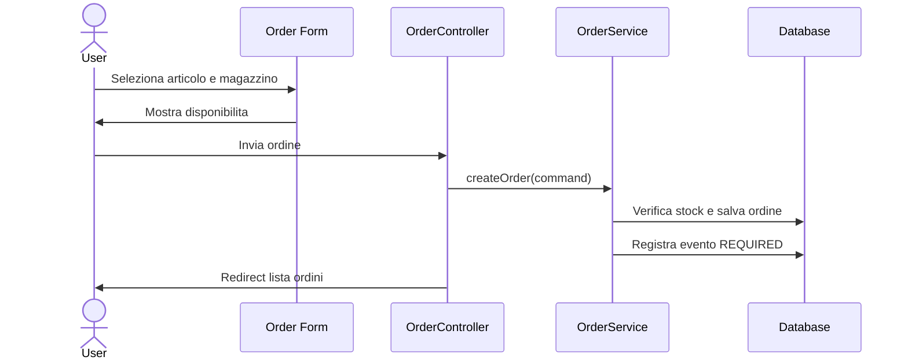

# Design

Questo documento definisce le linee guida UI/UX e i dettagli di design applicativo di Stockly.

Input:

* `docs/requirements.md`;
* `docs/architecture.md`.

Il documento deve contenere solo dettagli che aggiungono valore rispetto ad architettura e requisiti.

---

# 1. UX

Stockly e uno strumento operativo interno.

La UI deve essere:

* semplice;
* leggibile;
* prevedibile;
* orientata al completamento rapido dei flussi;
* sobria, senza composizione da landing page.

Principi:

* mostrare subito le informazioni utili;
* evitare schermate decorative;
* usare messaggi di errore chiari;
* mostrare solo azioni disponibili;
* confermare le operazioni riuscite;
* mantenere la navigazione coerente tra pagine.

---

# 2. Layout

La POC usa:

* header con brand e navigazione principale;
* contenuto centrato con larghezza massima;
* tabelle per dati operativi;
* form singoli per azioni principali.

Linee guida future:

* layout condiviso Thymeleaf;
* navigazione per ruolo;
* pagine dense ma leggibili;
* evitare card annidate;
* usare sezioni semplici e full-width quando opportuno.

---

# 3. Palette

Palette attuale:

* background: grigio molto chiaro;
* surface: bianco;
* testo: blu/grigio scuro;
* accento: teal/blu;
* danger: rosso sobrio;
* success: verde sobrio;
* warning/status required: giallo tenue.

Regole:

* evitare palette monocromatiche;
* mantenere contrasto sufficiente;
* usare colore solo per supportare stato o azione;
* non comunicare lo stato solo con il colore.

---

# 4. Typography

Regole:

* font system semplice;
* dimensioni coerenti con interfaccia operativa;
* niente hero typography nelle pagine applicative;
* label dei form sempre visibili;
* testo dei bottoni breve e orientato all'azione.

---

# 5. Componenti

Componenti base:

* header;
* navigazione;
* tabelle;
* form;
* select;
* input number;
* alert success/error;
* badge stato ordine;
* pulsanti primari/secondari/danger;
* pannello disponibilita stock.

Regole:

* i bottoni distruttivi usano stile `danger`;
* gli stati ordine usano badge coerenti;
* i form mostrano errori vicino al campo;
* i messaggi globali stanno sopra il contenuto principale;
* le azioni non consentite non devono essere solo nascoste in UI: il server deve comunque validare.

---

# 6. Component Design

## Form Ordine

Responsabilita:

* raccogliere articolo, magazzino e quantita;
* mostrare disponibilita quando articolo e magazzino sono selezionati;
* mostrare errori vicino ai campi;
* non sostituire la validazione server-side.

## Lista Ordini

Responsabilita:

* mostrare stato corrente;
* mostrare righe ordine;
* mostrare azioni disponibili;
* distinguere stati finali da ordini modificabili.

## Badge Stato

Stati:

* `REQUIRED`: evidenza warning;
* `APPROVED`: evidenza success;
* `REJECTED` e `CANCELED`: evidenza danger.

---

# 7. DTO e View Model

Quando una pagina richiede dati derivati o aggregati, preferire view model espliciti rispetto a entity JPA esposte direttamente.

Esempi:

* lista ordini con evento richiesta e ultimo evento;
* form ordine con disponibilita per coppia articolo-magazzino;
* dettaglio ordine con timeline audit.

---

# 8. Sequence Diagram

## Creazione Ordine

---

# 9. Responsive

Regole:

* layout mobile first per form;
* header e page title possono andare in colonna su viewport piccoli;
* tabelle operative possono usare scroll orizzontale;
* evitare overflow di testo nei bottoni;
* mantenere target cliccabili comodi.

---

# 10. Accessibilita

Regole:

* usare label esplicite per input;
* associare messaggi di stato dove utile;
* mantenere contrasto sufficiente;
* non affidare informazioni solo al colore;
* usare testo comprensibile per azioni;
* evitare focus trap non necessarie;
* mantenere ordine DOM coerente con lettura visiva.

---

# 11. Evoluzione

Prima di ampliare molto la UI:

* introdurre layout Thymeleaf condiviso;
* definire partial per navigazione, alert e form errors;
* valutare Bootstrap completo o componenti custom minimi;
* valutare HTMX solo se riduce complessita reale su schermate operative.
