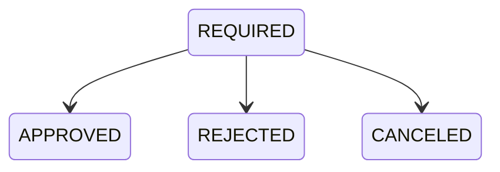
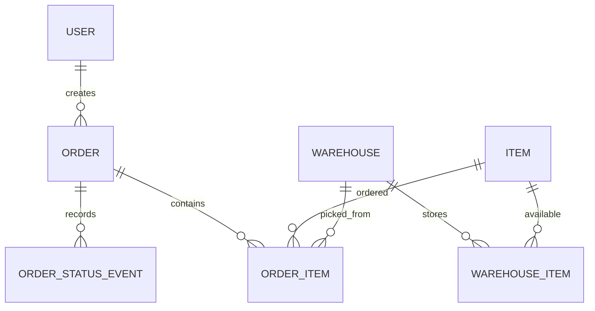

# Sistema di Gestione Magazzino e Ordini

## Documento Tecnico di Specifiche

Questo documento descrive le specifiche funzionali di alto livello. Per ulteriori dettagli consultare anche `docs/domain-rules.md`, `docs/architecture.md`, `docs/roadmap.md` e `docs/development-guidelines.md`.

**Versione:** 1.0  
**Data:** 2026-06-09

---

# 1. Introduzione

## 1.1 Obiettivo

Realizzare un'applicazione web monolitica per la gestione di magazzini e ordini interni.

Il sistema deve consentire:

* consultazione delle disponibilita dei magazzini;
* ricerca avanzata degli articoli;
* creazione e gestione degli ordini;
* approvazione, rifiuto o cancellazione degli ordini;
* gestione delle giacenze;
* produzione di PDF riepilogativi.

---

# 2. Architettura Tecnologica

## Backend

* Java 21
* Spring Boot
* Spring MVC
* Spring Data JPA
* Hibernate
* Spring Security
* Maven

## Frontend

* Thymeleaf
* Bootstrap
* HTMX opzionale

## Database

* PostgreSQL su Amazon RDS

## Deploy

* Docker
* GitHub
* AWS App Runner

## Generazione PDF

* OpenPDF oppure Apache PDFBox

---

# 3. Ruoli e Permessi

## ADMIN

Puo:

* effettuare ricerche;
* creare utenti;
* creare STORE_MANAGER;
* registrare articoli;
* gestire giacenze;
* creare ordini;
* visualizzare tutti gli ordini;
* approvare ordini;
* rifiutare ordini;
* cancellare ordini;
* scaricare PDF;
* accedere a tutte le schermate.

## STORE_MANAGER

Puo:

* effettuare ricerche;
* registrare articoli;
* gestire giacenze;
* creare ordini;
* visualizzare tutti gli ordini;
* approvare ordini;
* rifiutare ordini;
* cancellare ordini;
* scaricare PDF;
* accedere a tutte le schermate ad eccezione della gestione utenti.

Non puo creare utenze.

## USER

Puo:

* effettuare ricerche;
* creare ordini;
* visualizzare esclusivamente i propri ordini;
* visualizzare lo stato dei propri ordini;
* scaricare il PDF dei propri ordini;
* cancellare i propri ordini in stato REQUIRED.

Non puo:

* modificare lo stato degli ordini;
* visualizzare ordini altrui;
* gestire articoli;
* gestire giacenze;
* creare utenti.

---

# 4. Gestione Magazzini

Ogni magazzino possiede:

* id
* nome
* indirizzo

Il sistema supporta piu magazzini.

---

# 5. Gestione Articoli

Ogni articolo possiede:

* id
* barcode
* nome
* marca
* tipologia

Esempi di tipologia:

* bulloneria;
* tubature;
* utensili.

---

# 6. Gestione Giacenze

Lo stesso articolo puo essere presente in piu magazzini.

Ogni combinazione articolo-magazzino mantiene la propria quantita disponibile.

---

# 7. Ricerca Articoli

La ricerca consente il filtraggio per:

* nome articolo, con ricerca contains/like;
* barcode;
* marca;
* tipologia;
* magazzino.

I risultati devono essere mostrati separatamente per magazzino.

Esempio:

| Articolo   | Magazzino | Disponibilita |
| ---------- | --------- | ------------: |
| Bullone M8 | Milano    |            50 |
| Bullone M8 | Roma      |            20 |

---

# 8. Gestione Ordini

## 8.1 Concetto di Order e OrderItem

Un ordine e composto da una testata e da una o piu righe.

### Order

Rappresenta la testata dell'ordine.

Contiene:

* stato;
* informazioni generali non storicizzate;
* righe ordine collegate.

Esempio:

| id | status   |
| -- | -------- |
| 15 | REQUIRED |

### OrderItem

Rappresenta una singola riga dell'ordine.

Ogni riga specifica:

* articolo;
* magazzino;
* quantita.

Esempio:

| order_id | articolo | magazzino | quantita |
| -------- | -------- | --------- | -------: |
| 15       | Bullone  | Milano    |       10 |
| 15       | Martello | Roma      |        2 |

Un ordine puo contenere piu righe.

---

# 9. Stati Ordine

Stati disponibili:

* REQUIRED
* APPROVED
* REJECTED
* CANCELED

## Workflow



APPROVED, REJECTED e CANCELED sono stati finali.

---

# 10. Regole di Gestione Stock

## Creazione Ordine

Quando un ordine viene creato in stato REQUIRED:

* il sistema verifica la disponibilita;
* le quantita vengono immediatamente decrementate;
* lo stock viene considerato prenotato.

## APPROVED

Quando un ordine viene approvato:

* non vengono effettuate ulteriori modifiche alle giacenze.

## REJECTED

Quando un ordine viene rifiutato:

* le quantita prenotate vengono reintegrate;
* e possibile specificare una motivazione opzionale.

## CANCELED

Quando un ordine viene cancellato:

* le quantita prenotate vengono reintegrate;
* e possibile specificare una motivazione opzionale.

---

# 11. Creazione Ordini

Gli ordini possono contenere piu articoli.

## Magazzino Obbligatorio

Ogni riga ordine deve indicare un magazzino.

Regole:

* la quantita richiesta non puo superare la disponibilita del magazzino;
* il prelievo viene effettuato esclusivamente da quel magazzino.
* l'ordine non puo essere creato senza magazzino;
* la UI deve mostrare la disponibilita quando articolo e magazzino sono selezionati.

---

# 12. Regole di Transizione

## USER

Puo:

* creare ordini;
* cancellare esclusivamente i propri ordini in stato REQUIRED.

## ADMIN

Puo:

* approvare ordini;
* rifiutare ordini;
* cancellare ordini.

## STORE_MANAGER

Puo:

* approvare ordini;
* rifiutare ordini;
* cancellare ordini.

---

# 13. PDF Ordine

Da qualsiasi schermata di dettaglio ordine deve essere possibile generare un PDF.

Il PDF contiene:

* numero ordine;
* data creazione;
* utente richiedente;
* stato;
* elenco articoli;
* quantita;
* magazzini coinvolti;
* eventuale motivazione di rifiuto;
* eventuale motivazione di cancellazione.

I dati devono riflettere il contenuto presente a database.

---

# 14. Audit

Per ogni ordine deve essere tracciata la storia dei cambi stato in una tabella dedicata.

Ogni evento contiene:

* ordine collegato;
* stato precedente;
* nuovo stato;
* id utente che ha autorizzato l'operazione;
* timestamp dell'operazione;
* motivazione di rifiuto;
* motivazione di cancellazione.

La creazione dell'ordine e un evento:

* stato precedente nullo;
* nuovo stato `REQUIRED`;
* id utente richiedente;
* timestamp richiesta.

La testata ordine mantiene lo stato corrente, ma non duplica i dati di audit derivabili dagli eventi.

---

# 15. Modello Dati

## User

* id
* username
* password
* role
* enabled

## Warehouse

* id
* name
* address

## Item

* id
* barcode
* name
* brand
* type

## WarehouseItem

Rappresenta la giacenza di un articolo in un magazzino.

Campi:

* warehouse_id
* item_id
* quantity

## Order

Rappresenta la testata dell'ordine.

Campi:

* id
* status

## OrderItem

Rappresenta le righe dell'ordine.

Campi:

* id
* order_id
* item_id
* warehouse_id
* quantity

## OrderStatusEvent

Rappresenta un evento di creazione o cambio stato dell'ordine.

Campi:

* id
* order_id
* from_status
* to_status
* authorized_by_user_id
* authorized_at
* reason

---

# 16. Diagramma ER



---

# 17. Pagine Applicative

## Login

Autenticazione utenti.

## Dashboard

Accesso alle funzionalita disponibili in base al ruolo.

## Ricerca Articoli

Disponibile a tutti i ruoli.

Funzionalita:

* filtri;
* visualizzazione disponibilita;
* creazione ordini.

## Lista Ordini

ADMIN e STORE_MANAGER:

* visualizzazione di tutti gli ordini.

USER:

* visualizzazione dei propri ordini.

## Dettaglio Ordine

Visualizzazione di:

* dati ordine;
* righe ordine;
* stato;
* PDF;
* motivazioni.

Azioni disponibili in base al ruolo.

## Gestione Articoli e Giacenze

Disponibile ad ADMIN e STORE_MANAGER.

Funzionalita:

* inserimento articoli;
* modifica articoli;
* gestione quantita a magazzino.

## Gestione Utenti

Disponibile esclusivamente ad ADMIN.

Funzionalita:

* creazione utenti;
* creazione store manager;
* attivazione/disattivazione.

---

# 18. Sicurezza

Autenticazione:

* Spring Security;
* sessione HTTP tradizionale;
* form login.

Autorizzazione:

* Role Based Access Control.

Ruoli:

* ADMIN;
* STORE_MANAGER;
* USER.

---

# 19. Concorrenza

Per evitare inconsistenze di stock:

* le operazioni di prenotazione devono essere transazionali;
* utilizzare meccanismi di locking sulle giacenze;
* impedire prenotazioni concorrenti superiori alle disponibilita.

---

# 20. Deploy AWS

Architettura prevista:

```text
GitHub
  |
Docker Build
  |
AWS App Runner
  |
Spring Boot
  |
Amazon RDS PostgreSQL
```

Flusso di rilascio:

1. Push su GitHub;
2. build automatica Docker;
3. deploy automatico su App Runner;
4. connessione a RDS tramite variabili d'ambiente.

---

# 21. Evoluzioni Future

Possibili estensioni:

* notifiche email;
* esportazione Excel;
* dashboard statistiche;
* integrazione con sistemi esterni.

---

# 22. Considerazioni Finali

L'applicazione e progettata come monolite Spring Boot orientato alla semplicita operativa, alla facilita di manutenzione e a un'esperienza di sviluppo adatta a un team con forte competenza backend e limitata esperienza frontend.
