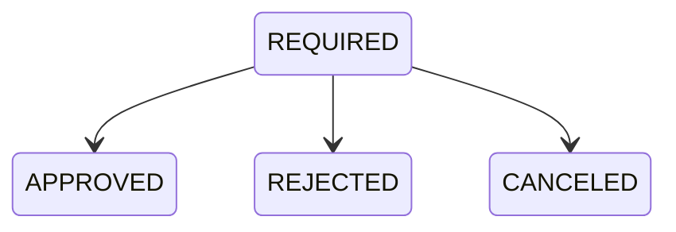

# Requirements

Questo documento e la fonte di verita funzionale di Stockly.

I requisiti definitivi devono rispettare lo standard definito in `docs/requirements_template.md`.

---

# 1. Vision

Stockly e un'applicazione web per la gestione di magazzini, giacenze e ordini interni.

Il sistema deve permettere di:

* consultare disponibilita per articolo e magazzino;
* ricercare articoli;
* creare ordini interni;
* approvare, rifiutare o cancellare ordini;
* mantenere lo stock coerente;
* tracciare la storia dei cambi stato ordine;
* generare PDF riepilogativi in una fase successiva.

---

# 2. Funzionalita

Funzionalita previste:

* gestione utenti e ruoli;
* gestione magazzini;
* gestione articoli;
* gestione giacenze;
* ricerca articoli;
* creazione ordini;
* workflow ordini;
* audit cambi stato ordine;
* PDF ordine.

Funzionalita disponibili nella POC:

* visualizzazione stock;
* inserimento o modifica disponibilita magazzino;
* creazione ordine;
* approvazione ordine;
* cancellazione ordine;
* reintegro stock su cancellazione;
* audit eventi stato ordine.

---

# 3. Requisiti Funzionali

## Ruoli

### ADMIN

Puo:

* effettuare ricerche;
* creare utenti;
* creare STORE_MANAGER;
* registrare articoli;
* gestire giacenze;
* creare ordini;
* visualizzare tutti gli ordini;
* approvare ordini;
* rifiutare ordini;
* cancellare ordini;
* scaricare PDF;
* accedere a tutte le schermate.

### STORE_MANAGER

Puo:

* effettuare ricerche;
* registrare articoli;
* gestire giacenze;
* creare ordini;
* visualizzare tutti gli ordini;
* approvare ordini;
* rifiutare ordini;
* cancellare ordini;
* scaricare PDF;
* accedere a tutte le schermate tranne gestione utenti.

Non puo:

* creare utenti;
* creare altri STORE_MANAGER.

### USER

Puo:

* effettuare ricerche;
* creare ordini;
* visualizzare esclusivamente i propri ordini;
* visualizzare lo stato dei propri ordini;
* scaricare PDF dei propri ordini;
* cancellare i propri ordini in stato `REQUIRED`.

Non puo:

* modificare lo stato degli ordini altrui;
* visualizzare ordini altrui;
* gestire articoli;
* gestire giacenze;
* creare utenti.

## Magazzini

Ogni magazzino possiede:

* id;
* nome;
* indirizzo.

Il sistema supporta piu magazzini.

## Articoli

Ogni articolo possiede:

* id;
* barcode;
* nome;
* marca;
* tipologia.

## Giacenze

Ogni combinazione articolo-magazzino mantiene una quantita disponibile.

Lo stesso articolo puo essere presente in piu magazzini.

La disponibilita puo essere inserita o modificata manualmente da UI.

Regole:

* l'utente seleziona articolo e magazzino;
* se la combinazione articolo-magazzino esiste, il sistema mostra la quantita attuale;
* se la combinazione articolo-magazzino non esiste, il sistema mostra quantita attuale `0`;
* la quantita e modificabile da tastiera;
* la quantita e modificabile tramite controlli `+` e `-`;
* la quantita minima e `0`;
* il valore salvato e assoluto, non incrementale;
* salvare una combinazione inesistente crea una nuova giacenza;
* salvare una combinazione esistente aggiorna la giacenza.

## Ricerca Articoli

La ricerca consente filtraggio per:

* nome articolo;
* barcode;
* marca;
* tipologia;
* magazzino.

I risultati devono essere mostrati separatamente per magazzino.

## Ordini

Un ordine e composto da:

* testata ordine;
* una o piu righe ordine;
* eventi di stato collegati.

Ogni riga ordine specifica:

* articolo;
* magazzino;
* quantita.

Ogni riga ordine deve indicare un magazzino.

---

# 4. User Stories

## Consultazione Stock

Come utente voglio consultare disponibilita per articolo e magazzino, cosi posso decidere cosa ordinare.

Acceptance criteria:

* lo stock mostra articolo, magazzino e quantita disponibile;
* lo stesso articolo puo comparire su piu magazzini;
* le quantita non possono essere negative.

## Modifica Disponibilita

Come ADMIN o STORE_MANAGER voglio inserire o modificare la disponibilita di un articolo in un magazzino, cosi posso mantenere aggiornate le giacenze.

Acceptance criteria:

* il form richiede articolo e magazzino;
* il sistema mostra la quantita attuale della combinazione selezionata;
* se non esiste una giacenza, la quantita attuale e `0`;
* l'utente puo modificare la quantita da tastiera;
* l'utente puo aumentare o diminuire la quantita con controlli `+` e `-`;
* il controllo `-` non puo portare la quantita sotto `0`;
* il salvataggio imposta la quantita finale al valore indicato;
* se la riga non esiste, viene creata;
* se la riga esiste, viene aggiornata;
* al termine l'utente torna alla lista stock con messaggio di successo.

## Creazione Ordine

Come utente voglio creare un ordine scegliendo articolo, magazzino e quantita, cosi posso prenotare stock specifico.

Acceptance criteria:

* il magazzino e obbligatorio;
* la UI mostra la disponibilita quando articolo e magazzino sono selezionati;
* la quantita richiesta non puo superare la disponibilita del magazzino;
* l'ordine nasce in stato `REQUIRED`;
* la creazione decrementa lo stock;
* se lo stock non basta, l'ordine non viene creato.

## Gestione Ordine

Come ADMIN o STORE_MANAGER voglio approvare o rifiutare un ordine, cosi posso completare il workflow.

Acceptance criteria:

* solo ordini `REQUIRED` possono cambiare stato;
* `APPROVED`, `REJECTED` e `CANCELED` sono finali;
* approvare non modifica lo stock;
* rifiutare reintegra lo stock;
* ogni cambio stato registra un evento audit.

## Cancellazione Ordine

Come USER voglio cancellare un mio ordine `REQUIRED`, cosi posso liberare lo stock prenotato.

Acceptance criteria:

* USER cancella solo propri ordini;
* ADMIN e STORE_MANAGER possono cancellare qualsiasi ordine `REQUIRED`;
* cancellare reintegra esattamente le righe ordine;
* la cancellazione registra un evento audit.

## PDF Ordine

Come utente voglio scaricare un PDF dell'ordine, cosi posso conservarne un riepilogo.

Acceptance criteria:

* il PDF riflette i dati salvati;
* contiene numero ordine, data richiesta, utente richiedente, stato, righe, quantita e magazzini;
* include eventuali motivazioni di rifiuto o cancellazione;
* rispetta le stesse regole di accesso del dettaglio ordine.

---

# 5. Domain Rules

## Creazione Ordine

Alla creazione:

* l'ordine nasce sempre in stato `REQUIRED`;
* il sistema verifica la disponibilita;
* le quantita vengono decrementate immediatamente;
* lo stock decrementato rappresenta stock prenotato;
* se la disponibilita non basta, l'ordine non viene creato;
* l'operazione deve essere atomica.

## Magazzino Obbligatorio

Ogni riga ordine deve indicare un magazzino.

Regole:

* la quantita richiesta deve essere disponibile in quel magazzino;
* il prelievo avviene solo da quel magazzino;
* viene creata una riga ordine per quel magazzino;
* l'ordine non puo essere creato se il magazzino non e selezionato;
* la UI deve mostrare la disponibilita quando articolo e magazzino sono selezionati.

## Invarianti Stock

Le seguenti regole devono essere sempre vere:

* la quantita stock non puo essere negativa;
* la modifica manuale della disponibilita salva una quantita assoluta;
* non si puo prenotare piu della disponibilita;
* ogni modifica stock collegata a un ordine deve essere transazionale;
* rifiuto e cancellazione devono reintegrare esattamente le righe ordine;
* approvazione non deve reintegrare ne decrementare stock.

## Movimenti di Magazzino

La modifica disponibilita prevista per MVP non registra movimenti incrementali.

Fuori scope per questa feature:

* carichi e scarichi separati;
* causali di movimento;
* storico movimenti giacenza;
* rettifiche tracciate.

Queste funzionalita potranno essere introdotte in una fase successiva.

## Audit Ordine

Per ogni creazione o cambio stato deve essere memorizzato un evento separato con:

* riferimento all'ordine;
* stato precedente, nullable per la creazione;
* nuovo stato;
* id utente che ha autorizzato l'operazione;
* timestamp dell'operazione;
* motivazione di rifiuto, se presente;
* motivazione di cancellazione, se presente.

La creazione ordine e rappresentata da un evento con:

* stato precedente nullo;
* nuovo stato `REQUIRED`;
* id utente richiedente;
* timestamp richiesta.

---

# 6. Stati e Transizioni

Stati disponibili:

* `REQUIRED`;
* `APPROVED`;
* `REJECTED`;
* `CANCELED`.

Stati finali:

* `APPROVED`;
* `REJECTED`;
* `CANCELED`.

Transizioni consentite:

* `REQUIRED -> APPROVED`;
* `REQUIRED -> REJECTED`;
* `REQUIRED -> CANCELED`.

Nessuna altra transizione e consentita.

## APPROVED

* lo stock non cambia;
* viene registrato un evento di cambio stato;
* l'ordine diventa finale.

## REJECTED

* le quantita prenotate vengono reintegrate;
* puo essere salvata una motivazione;
* viene registrato un evento di cambio stato;
* l'ordine diventa finale.

## CANCELED

* le quantita prenotate vengono reintegrate;
* puo essere salvata una motivazione;
* viene registrato un evento di cambio stato;
* l'ordine diventa finale.

---

# 7. Vincoli Funzionali

Vincoli:

* nessun ordine puo portare stock sotto zero;
* nessuna transizione e consentita da stato finale;
* la UI non e l'unico livello di protezione;
* le regole business devono essere applicate lato server.

---

# 8. MVP

MVP post-POC:

* autenticazione e ruoli reali;
* utenti persistenti;
* CRUD magazzini;
* CRUD articoli;
* gestione giacenze con inserimento e modifica disponibilita;
* ricerca articoli;
* ordine multi-riga;
* workflow completo con `APPROVED`, `REJECTED`, `CANCELED`;
* audit eventi ordine;
* test su regole stock e permessi.

---

# 9. Future Features

Funzionalita future:

* PDF ordine;
* motivazione obbligatoria o opzionale per reject/cancel, da decidere;
* dashboard statistiche;
* esportazione Excel;
* notifiche email;
* integrazioni con sistemi esterni;
* HTMX solo se aggiunge valore concreto.
